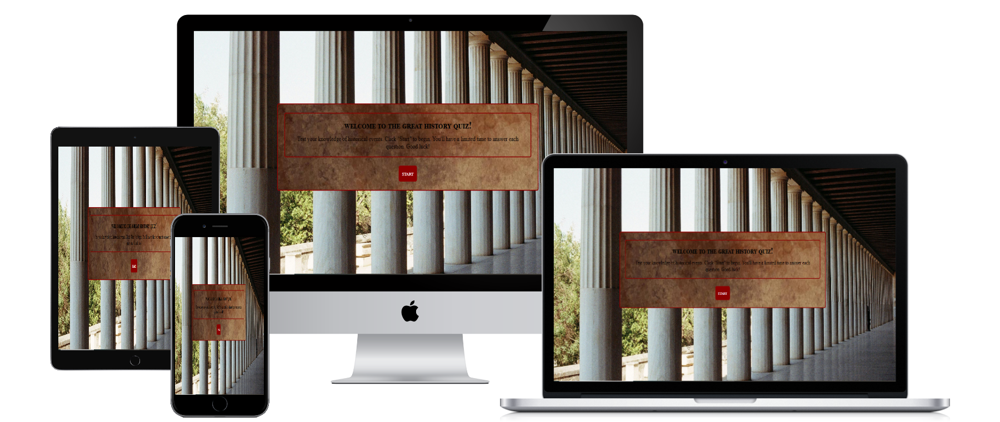
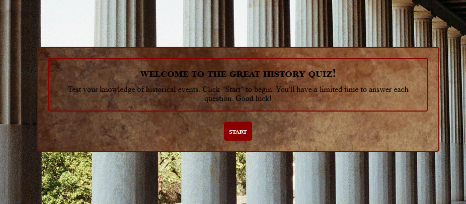
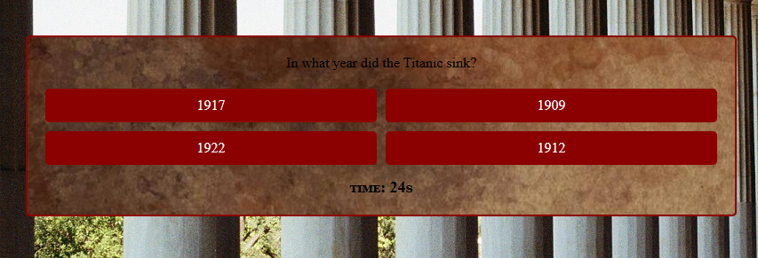
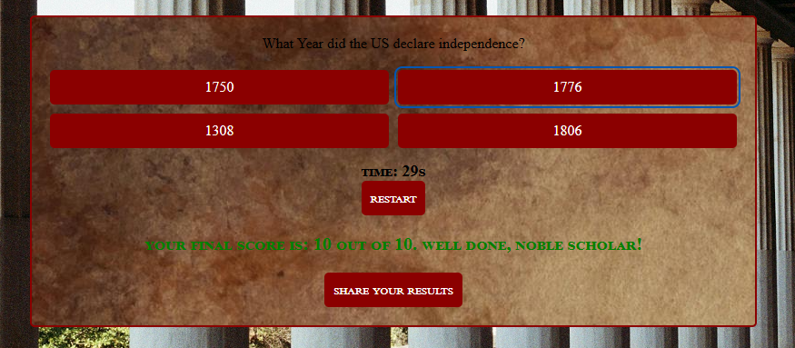
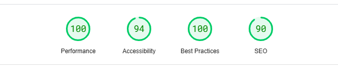
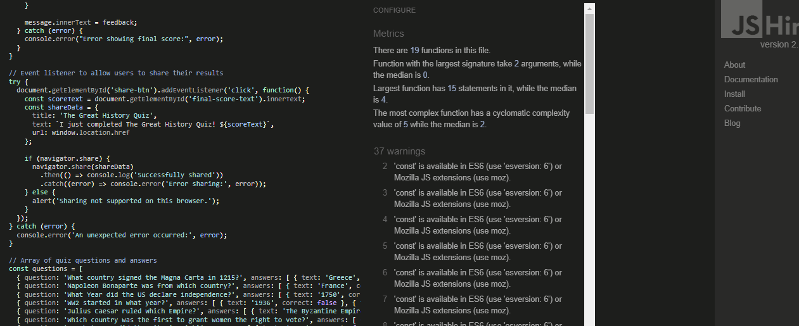

# **The Great History Quiz**  
  

[**View the project here:**](https://cmq1996.github.io/Portfolio-2/)  

---

## **Table of Contents**
- [User Experience (UX)](#user-experience-ux)
  - [Target Audience](#target-audience)
  - [User Goals](#user-goals)
  - [Project Story](#project-story)
- [Design](#design)
  - [Thematic Aesthetic](#thematic-aesthetic)
  - [Wireframes](#wireframes)
- [Features](#features)
- [Technologies Used](#technologies-used)
- [Testing & Bugs](#testing--bugs)
- [Deployment and Local Development](#deployment-and-local-development)
- [Credits & Acknowledgments](#credits--acknowledgments)
- [Final Thoughts](#final-thoughts)

---

## **User Experience (UX)**  

### **Target Audience**  
- Students, educators, and history enthusiasts.  
- Ages 12+ (middle school, high school, and casual learners).  
- Competitive players looking to challenge their knowledge.  

### **User Goals**  
- Test and improve history knowledge in a fun way.  
- Compete for high scores and improve with multiple attempts.  
- Engage with an educational yet entertaining quiz experience.  
- Share results with friends and on social media.  

### **Project Story**  
Inspired by the success of *Kahoot!* and gamification in learning, this project aims to make history quizzes more engaging and accessible across devices. Designed with simplicity and competition in mind, *The Great History Quiz* provides an interactive experience while maintaining a historical aesthetic.  

---

## **Design**  

### **Thematic Aesthetic**  
- **Fonts:** *Cormorant Garamond* (classic, aged feel) & *Gotham Rounded* (modern touch).  
- **Backgrounds:** Vintage textures and historical images.  
- **Colors:** Deep burgundy, neutral tones, and parchment-like backgrounds.  
- **Layout:** Grid-based answer buttons for easy selection and readability.  
- **Animations:** Hover effects and dynamic feedback on answers.  

### **Wireframes**  
**Instructions Page:**  

**Quiz Page:**  

**Final Score Page:**  
  

---

## **Features**  

### **Core Features**
- **Start Screen:** Instructions with a "Start" button.  
- **Timed Questions:** 30-second countdown per question.  
- **Answer Feedback:** Correct answers turn green, incorrect turn red.  
- **Final Score Display:** Summarizes performance at the end.  
- **Social Sharing:** Option to share results online.  
- **Responsive Design:** Mobile and desktop-friendly layout.  

### **Interactive Features**
- **Button Effects:** Smooth transitions and hover effects.  
- **Dynamic Quiz Flow:** Hides/show elements based on progress.  
- **Keyboard Accessibility:** Fully navigable via keyboard.  

---

## **Technologies Used**  

- **HTML5** – Structure of the quiz.  
- **CSS3** – Styling and responsive design.  
- **JavaScript** – Quiz functionality and interactivity.  
- **Google Fonts** – *Cormorant Garamond* and *Gotham Rounded*.  
- **GitHub Pages** – Deployment of the live quiz.  

---

## **Testing & Bugs**  

### **Manual Testing**
✅ Checked responsiveness on mobile, tablet, and desktop.  
✅ Verified correct/wrong answers display correctly.  
✅ Timer functionality tested for accuracy.  
✅ Social sharing buttons tested on different platforms.  
✅ Tested for keyboard navigation and screen reader compatibility.  

### **Bugs Found & Fixes**  
❌ **Button hover effect inconsistent on mobile** – *Fixed by adjusting CSS for touch devices.*  
❌ **Timer not resetting on new questions** – *Resolved by resetting the timer in JavaScript after each question.*  
❌ **Final score sometimes displayed incorrectly** – *Fixed by ensuring score updates properly after each question.*  
❌ **Layout shifting on smaller screens** – *Adjusted media queries for better responsiveness.*  

---
### **Testing**  

**Tested on Lighthouse**

**Tested jsHint**
## **Deployment and Local Development**  

### **Deploying via GitHub Pages**
1. Push the latest version to GitHub.  
2. Go to **Settings > Pages** in your repository.  
3. Select the branch (e.g., `main`) and click **Save**.  
4. The live site will be available at:  
   👉 `https://yourusername.github.io/your-repo/`  

## **Credits & Acknowledgments**  

## **Credits & Acknowledgments**  

- **Tutor Support:** A huge thank you to *Rory Patrick* for providing guidance, feedback, and support throughout the project.  
- **Images:** *Pexels, Unsplash* (Royalty-free historical images).  
- **Fonts:** *Google Fonts* (*Cormorant Garamond*, *Gotham Rounded*).  
- **Inspiration:** *Kahoot!* for gamified quiz concepts.  
- **Testing Assistance:** Thanks to friends and beta testers for their feedback!  
- **Learning Resources:** *W3Schools* for HTML, CSS, and JavaScript references.  

